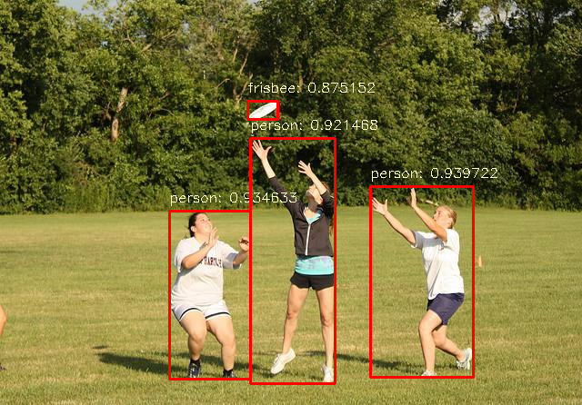

# yolov9-onnx-opencv
yolov9 导出onnx 模型，C++ 使用opencv dnn 预测



## Requirements

请自行编译

[OpenCV 4.9.0](https://github.com/opencv/opencv/releases/tag/4.9.0)

[yaml-cpp](https://github.com/jbeder/yaml-cpp)

## Installation

```shell
git clone https://github.com/WeiZhenOoooo/yolov9-onnx-opencv.git
cd yolov9-onnx-opencv
```

修改CMakeLists.txt，line 6 和 line 7

```cmake
set(OpenCV_DIR "D:/CredLib_DIR/opencv47/build")
set(Yaml_Cpp_DIR "D:/CredLib_DIR/yaml-cpp")
```

将**OpenCV_DIR**和**Yaml_Cpp_DIR**的路径修改为本机的实际路径，**CMake编译**

将**yaml-cpp.dll**复制到可执行文件**yolo-onnx-opencv.exe**的所在目录，准备执行

## Examples

### Arguments

```shell
E:\code\yolov9-onnx-opencv\cmake-build-release>.\yolo-onnx-opencv.exe -h
yolo onnx opencv dnn pred description
Usage: .\yolo-onnx-opencv.exe [OPTIONS]

Options:
  -h,--help                   Print this help message and exit
  -w,--weights TEXT           onnx model path
  -c,--config TEXT            train yolo yaml path, to find classes definition
  -i,--input TEXT             pred input path
  -z,--size INT               input size(size * size), default:640 * 640
  -t,--threshold FLOAT        threshold score, default: 0.5
  --image,--no-image{false}   Image inference mode
  --video,--no-video{false}   Video inference mode
  --gpu,--no-gpu{false}       Cuda inference mode
```

如果要使用`--gpu`参数，请自行编译**opencv GPU**版本

### Inference on Image

```shell
.\yolo-onnx-opencv.exe --weights ..\weights\yolov9-c.onnx -c ..\example\metadata.yaml -i ..\example\000000000625.jpg --image
```

### Inference on Video

```shell
.\yolo-onnx-opencv.exe --weights ..\weights\yolov9-c.onnx -c ..\example\metadata.yaml -i ..\example\road.mp4 --video
```

# References:

- YOLOv9 : https://github.com/WongKinYiu/yolov9
